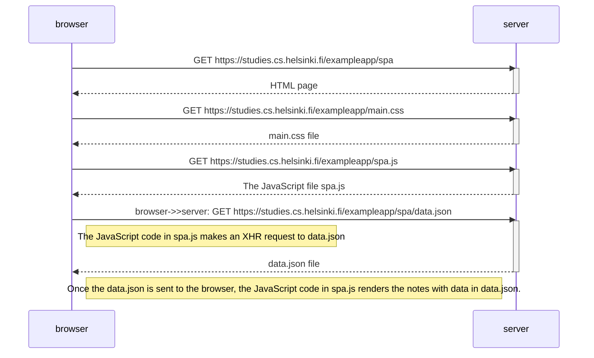

```mermaid
sequenceDiagram
	participant browser
	participant server
	
	browser->>server: GET https://studies.cs.helsinki.fi/exampleapp/spa
	activate server
	
	server-->>browser: HTML page
	deactivate server
	
	browser->>server: GET https://studies.cs.helsinki.fi/exampleapp/main.css
	activate server
	
	server-->>browser: main.css file
	deactivate server
	
	browser->>server: GET https://studies.cs.helsinki.fi/exampleapp/spa.js
	activate server

	server-->>browser: The JavaScript file spa.js
	deactivate server
	
	browser->>server: 	browser->>server: GET https://studies.cs.helsinki.fi/exampleapp/spa/data.json
	activate server 
	
	Note right of browser: The JavaScript code in spa.js makes an XHR request to data.json
	
	server-->>browser: data.json file
	deactivate server
	
	Note right of browser: Once the data.json is sent to the browser, the JavaScript code in spa.js renders the notes with data in data.json. 
```
