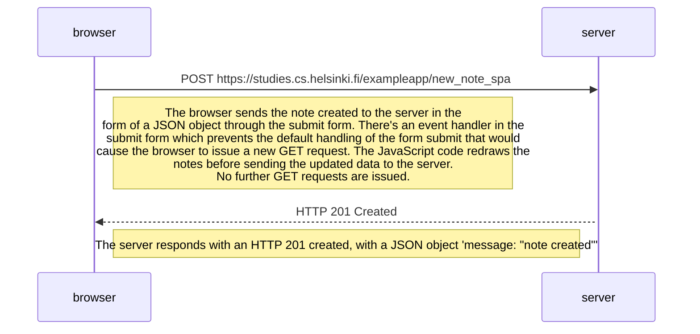

```mermaid
sequenceDiagram
	participant browser
	participant server
	
	browser->>server: POST https://studies.cs.helsinki.fi/exampleapp/new_note_spa
	activate server
	
	Note right of browser: The browser sends the note created to the server in the <br> form of a JSON object through the submit form. There's an event handler in the<br> submit form which prevents the default handling of the form submit that would <br> cause the browser to issue a new GET request. The JavaScript code redraws the <br>notes before sending the updated data to the server.<br> No further GET requests are issued. 
	
	server-->>browser: HTTP 201 Created 
	
	Note left of server: The server responds with an HTTP 201 created, with a JSON object 'message: "note created"'
```
